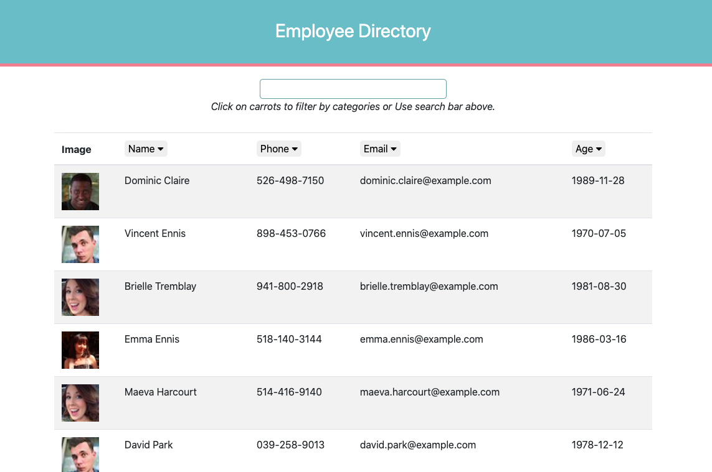

# React: Employee-Directory

## Description

An employee or manager would benefit greatly from being able to view non-sensitive data about other employees. It would be particularly helpful to be able to filter employees by name. This application will have users to be able to view the entire employee directory at once so that they have quick access to their information. 

## Demo
### Heroku Application
[Click Here to checkout a deployed application](https://obscure-taiga-20697.herokuapp.com/)
### Screenshots

## Intruction

- Once the application is loaded, random users list will populated including the information such as an image, name, phone numbers, email, and date of birth.
- To sort the list in an alphabetical order, click on each categories `Name`, `Phone`, `Email`, and `Age`.
- To filter lists by letters of Name, enter letters into input box.  

## Usage

Given a table of random users, when the user loads the page, a table of employees should render. Users then will be able to sort the table by at least one category alphabetically, and filter names by inputed letters.

## License

- **[MIT License](https://opensource.org/licenses/MIT)** 
- 2020 React Employee Directory

## Questions
| Ask me Now! |
| :---: |
|  |
| <a href="https://github.com/nuleeannajeon" target="_blank">Checkout Github Profile</a> |